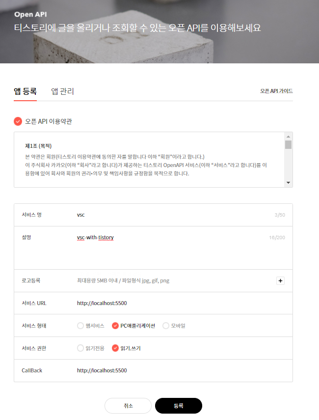
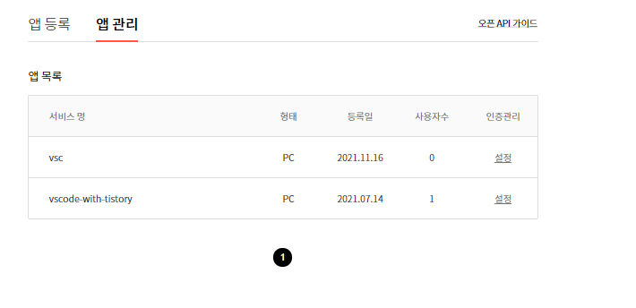
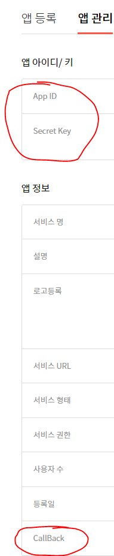
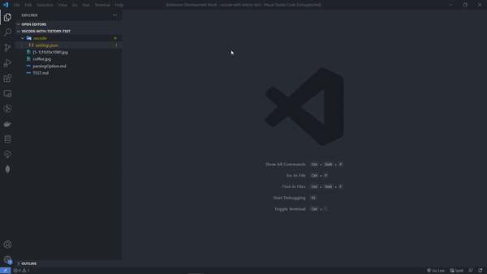
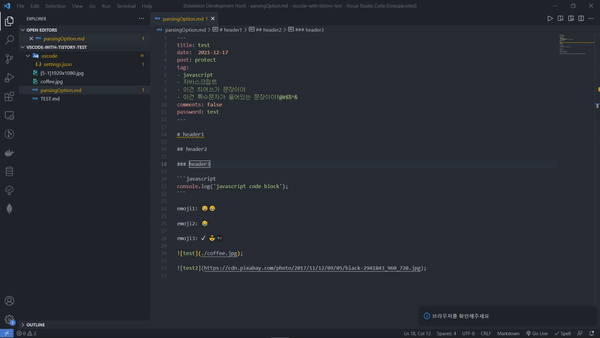
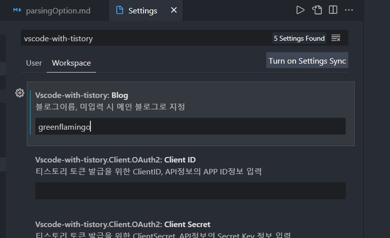
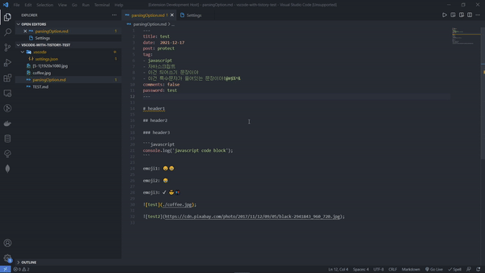
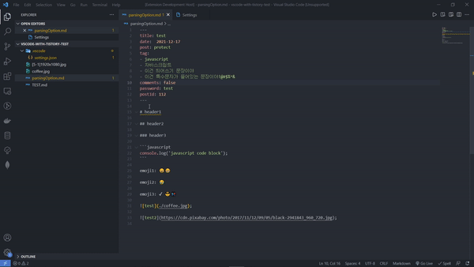
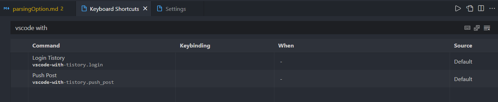

# vscode-with-tistory

vscode에서 tistory게시글을 업로드 및 수정할 수 있는 extension이다. 마크다운 형식으로 작성을 하면 블로그에 업로드를 수행한다. 깃허브 블로그로 마크다운 포맷으로 작성된 마크다운 파일을 티스토리에 그대로 올릴 수 있다.

## ⚙ 사전 준비

**vscode는 tistory api를 사용하기 위한 파라미터 값이 내장되어있지 않다.** 이유는 [vscode개발일기2](https://greenflamingo.tistory.com/23) 때문이다. 이를 위해 tistory 오픈 api에서 등록을 수행하고 extension에 tistory api를 사용하기 위한 파라미터를 등록하는 과정을 수행한다.

### 🔏 1. tistory api승인받기

https://www.tistory.com/guide/api/manage/register

위의 url로 들어가서 티스토리 로그인을 수행하고 api인증을 받는다. 인증형식은 다음과 같다.




서비스 url, 콜백함수, 서비스 권한 이외에는 자유롭게 작성해도 문제없다. 만약 서비스 url과 콜백 url의 포트번호를 바꾸고 싶다면 포트번호만 바꿔서 사용할 수 있다.

승인은 즉시처리되고 앱 목록에서 등록한 서비스의 인증관리의 설정으로 들어간다.



승인된 목록에서 설정을 클릭하면 나오는 정보중에 AppID, ClientSecret, Callback값을 확인한다. 



확왼된 값은 vscode에 입력한다. 입력은 메뉴의 File -> preferences -> Settings 혹은 단축키로 Ctrl+, 를 이용해 설정창을 열어서 extension의 vscode-with-tistory에 입력한다. 
App ID는 Client ID, Client Secret은 Client Secret에, callback은 Redirect URI에 입력한다. Redirect URI은 기본값으로 'http://localhost:5500' 을 가진다. 만약 사용자의 callback값의 포트번호가 5500이 아니면 포트번호만 수정하여야 한다.
User에 입력하면 모든 vscode project에 적용되고 Workspace에 입력하면 현재 입력하는 vscode project에만 적용된다.



### 🔑 2. 티스토리 액세스 토큰 발급받기

티스토리 api를 사용하기 위한 파라미터를 이용해 액세스 토큰을 발급받는다. **F1 -> Login Tistory** 라고 입력하면 외부 브라우저가 열리면서 extension이 티스토리를 제어할 수 있는 값을 받아오는 준비를 한다. 브라우저가 열리면 티스토리 로그인을 수행한다.



기본 브라우저에 이미 로그인이 되어있으면 로그인 과정이 생략되고 extension에 값을 줄 것인지 허용하는 창이 나온다. 여기서 허가하기 버튼을 누르고 close web page창이 나오면 액세스 토큰이 발급이 성공하였다는 것을 의미한다.

## 🧾기능

### ✔ 업로드를 수행할 블로그 선택

사용자가 가지고 있는 여러개의 블로그 중에 특정 블로그에 업로드를 수행할 수 있다. 만약 값이 없으면 디폴트 블로그로 결정된다. 이는 여러 블로그를 운영중인 사용자 위해 제공되는 기능이다.



### 📝 게시글 생성 및 수정

마크다운 파일 최상단 부분에 다음과 같은 포맷을 이용하여 티스토리에 올릴 게시글의 정보를 입력한다.

```yaml
---
title: text
date: yyyy-MM-dd hh:mm:ss | yyyy-MM-dd
post: public | protect | private | true | false
tag:
- tag1
- tag2
comments: true | false
password: text
category: text
url: text
postId: int
---
```

게시글의 정보는 다음과 같다.

- title: 게시글의 제목
- date: 게시글이 올라갈 날짜(단 과거시간은 불가능)
  - 2가지 포맷으로 작성 가능
    1. yyyy-MM-dd
    2. yyyy-MM-dd hh:mm:ss
  - 1번의 경우 시간은 업로드를 수행한 시간으로 입력된다.
- post: 게시글의 공개 여부
  - public, true: 공개
  - protect: 게시글 보호
  - private, false: 비공개
- tag: 게시글의 태그
- comments: 게시글의 댓글 허용 여부
- password:게시글 비밀번호
- category: 게시글 카테고리 이름
- url: 블로그 설정에서 포스트 url을 문자로 보여주는 기능을 사용하였을 때 보여줄 문자
- postId: 작성된 게시글의 id

**게시글 생성은 title, post정보 이외에는 모두 선택사항이다.**

작성된 마크다운 파일을 가리키고 **F1 -> push post**라고 입력하고 기다리면 블로그 포스팅이 완료된다. 이때 블로그의 url을 사용자에게 보여주면서 실제 tistory에 게시글이 정상적으로 올려졌는지 확인할 수 있다. 



**새로운 게시글을 작성하는 과정과 게시글을 수정하는 과정은 같다.** postId값의 존재 여부로 새로운 게시글을 올리는 과정인지, 기존의 게시글을 수정하는 과정인지를 파악하기 때문이다. postId값은 게시글을 올리면 extension이 직접 작성하므로 사용자가 별도로 입력할 필요가 없다.



만약 게시글 업로드 기능을 단축키로 사용하고 싶으면 vscode-with-tistory.push_post command를 매핑하여 사용하면 된다.



## ❌ 제약 사항

본 extension은 다음과 같은 제약사항이 존재한다.

1. **html코드는 단순 텍스트로 삽입된다.** 이는 markdown-it정책상 html코드는 기본적으로 허용되지 않기 때문이다. 이 제약사항은 추후 업데이트에 따라 해제될 수 있다.
2. code태그는 티스토리 플러그인인 코드 문법 강조를 사용해야 정상적으로 출력된다.
3. 티스토리와 로컬 스토리지간 동기화를 제공하지 않는다. 웹에서 티스토리 게시글을 수정한다 하더라도 로컬 파일의 정보가 수정되진 않는다.
4. 별도로 다운로드를 수행하는 파일을 올리진 않는다. 이유는 티스토리 api로 올릴 수 있는 파일은 이미지파일로 제한되어있기 때문이다.
5. 티스토리 api서비스가 중단되면 해당 extension의 모든 기능은 사용할 수 없다.

### 📋 modules

본 extension을 작성하기 위해 다음과 같은 모듈을 사용했음을 명시함

- markdown-it
- markdown-it-emoji
- form-data
- axios
- double-ended-queue